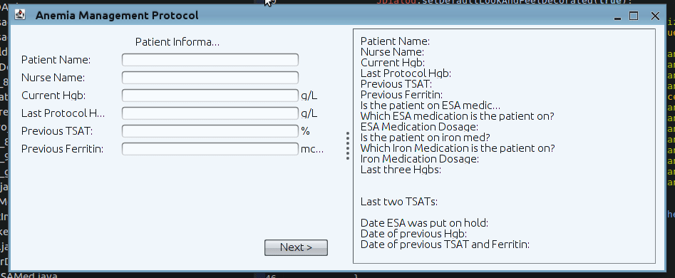

# AnemiaManagementProtocol

One example of where software can assist healthcare professionals is the Anemia Management Protocol. This protocol is used by nurses to administer the correct amount of dosage of a number of types of medications to kidney patients. This process requires mathematical calculations and following a complex flow chart that is prone to human error. This software application automates the process for the nurse, carrying out the calculations and walking the nurse through the flow chart automatically. Once the process is commplete, the information can be exported in the form of a PDF report reducing the possibility of human error while copying numbers fromm one medium to another. An added  advantage of this approach is that it can significantly reduce the amount of time that is to be spent on each patient.

This application was written in Java Swing.
